<div align="center">

<!-- ANIMATED HEADER — Save header.svg to your repo root /assets/ folder -->


</div>

<br/>

<div align="center">

[](https://git.io/typing-svg)

<br/>


&nbsp;
[](https://github.com/IamWaqasMuhammad)

</div>

---

## ◈ `~/about-me`

```dart
class WaqasMuhammad extends FlutterDeveloper {

  final String name       = "Waqas Muhammad";
  final String location   = "Pakistan 🇵🇰";
  final String focus      = "Flutter — Mobile & Cross-Platform";
  final String portfolio  = "waqasmuhammad.vercel.app";
  final String email      = "waqasmuhammad5254@gmail.com";

  List<String> currentlyDoing = [
    "⚡ Building production-grade Flutter apps",
    "📚 Mastering advanced Flutter patterns",
    "🎯 Exploring Clean Architecture & DDD",
  ];

  String funFact() =>
      "I turn ☕ coffee into code, and 🐛 bugs into features!";
}
```

---

## ◈ `~/tech`

<div align="center">

| Core | State Management | Backend | Database | Tooling |
|:---:|:---:|:---:|:---:|:---:|
|  |  |  |  |  |
|  |  |  |  |  |
| | | | |  |

</div>

---

## ◈ `~/projects`

<table>
<tr>
<td width="50%" valign="top">

### 🖼️ WallPaper Downloader
> Clean & blazing-fast wallpaper app. Browse, preview, and download high-quality wallpapers with a sleek modern UI.


[](https://github.com/IamWaqasMuhammad/Wallpaper-Downloader-App)

</td>
<td width="50%" valign="top">

### 📷 QR Code Scanner
> Full-featured QR scanner & generator app. Scan any QR type or generate custom codes instantly.


[](https://github.com/IamWaqasMuhammad/QR-Code-Scanner-App)

</td>
</tr>
<tr>
<td width="50%" valign="top">

### 🎫 NEXT PASS *(Internship)*
> Smart visitor management & digital pass generation system. Streamlines access control with modern workflows.


[](https://github.com/Nitishroy-7033/NEXT-PASS)

</td>
<td width="50%" valign="top">

### 🍔 FoodHub App
> Complete food ordering + recipes app with real backend integration. Full order flow from browse to checkout.


[](https://github.com/IamWaqasMuhammad/Flutter-Food-Hub-App)

</td>
</tr>
</table>

---

## ◈ `~/github-stats`

<div align="center">


&nbsp;


<br/><br/>


<br/><br/>

[](https://github.com/ryo-ma/github-profile-trophy)

</div>

---

## ◈ `~/contribution-graph`

<div align="center">

[](https://github.com/ashutosh00710/github-readme-activity-graph)

</div>

---

## ◈ `~/quote`

<div align="center">

```
╔══════════════════════════════════════════════════════════════════════╗
║                                                                      ║
║   "If you were to rely upon Allah with the reliance He is due,       ║
║    He would provide for you just as He provides for the birds —      ║
║    they go out in the morning with empty stomachs and return full."  ║
║                                                                      ║
║                          — Prophet Muhammad ﷺ  (at-Tirmidhi)       ║
║                                                                      ║
╚══════════════════════════════════════════════════════════════════════╝
```

</div>

---

## ◈ `~/connect`

<div align="center">

[](https://waqasmuhammad.vercel.app)
[](https://github.com/IamWaqasMuhammad)
[](https://www.linkedin.com/in/waqas-muhammad-0ba609290/)
[](https://instagram.com/waqas_5254)
[](mailto:waqasmuhammad5254@gmail.com)

</div>

---

<div align="center">
  
  <sub><b>⭐ @IamWaqasMuhammad</b> — crafting apps, one widget at a time.</sub>
</div>
